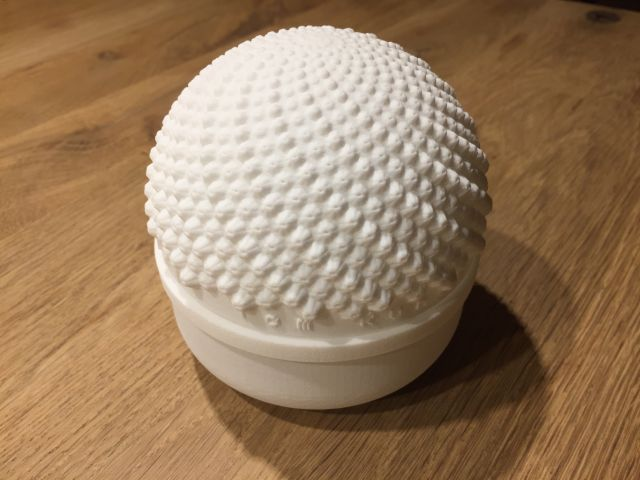
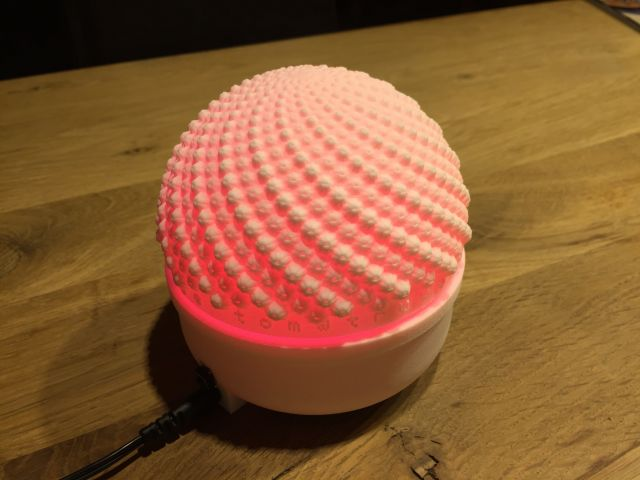

# flux replica

This is a shameless and incompetent replica of the inconceivably beautiful [flux](http://www.project-flux.com/) art project. 

See it [in action](https://www.youtube.com/watch?v=VT36s4eyMLo). The videos don't show the reality 100%, as there is some interference in camera shutter and strobe frequency. You need a better camera to film it like the original artists did.

The sculpture is modeled with FreeCAD (and quite a lot of Python scripting) and 3D printed in Selective Laser Sintering technique, which makes it very good looking. Unfortunately, my FreeCAD-scripts got lost on one laptop upgrade step. :confounded: I modeled one pimple manually, replicated and placed it a few hundert times with scripting. This step involved heavy 3D and some fibonacci calculations: rotating, shifting in all dimensions.

